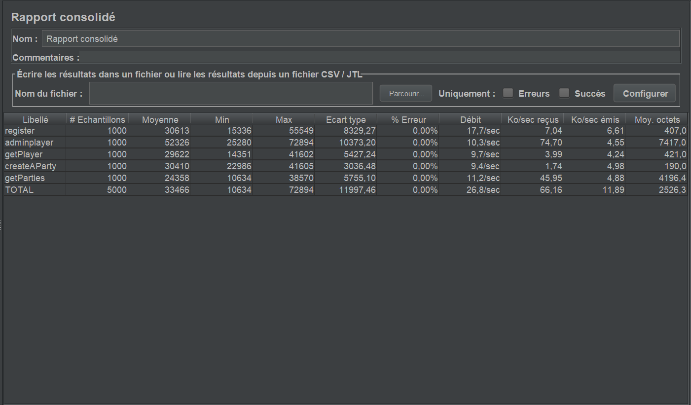
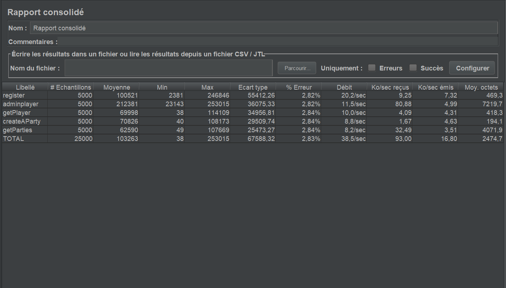
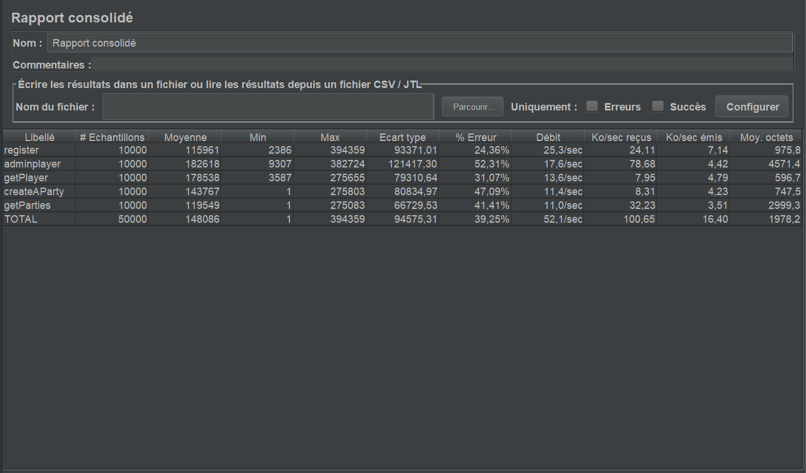

# testing Strategy

## Cucumber

We use cucumber to implement automated functional tests for our APIs.

## Jmeter

We used Jmeter to load and performance test our app.

### 1000 load

### 5000 load

### 10000 load

### Opinion

Our tests seem fairly complete and in working order.

Similar to our last project all our tests are run manually but for larger and longer projects we would need a better testing strategy like setting up a testing pipeline.
